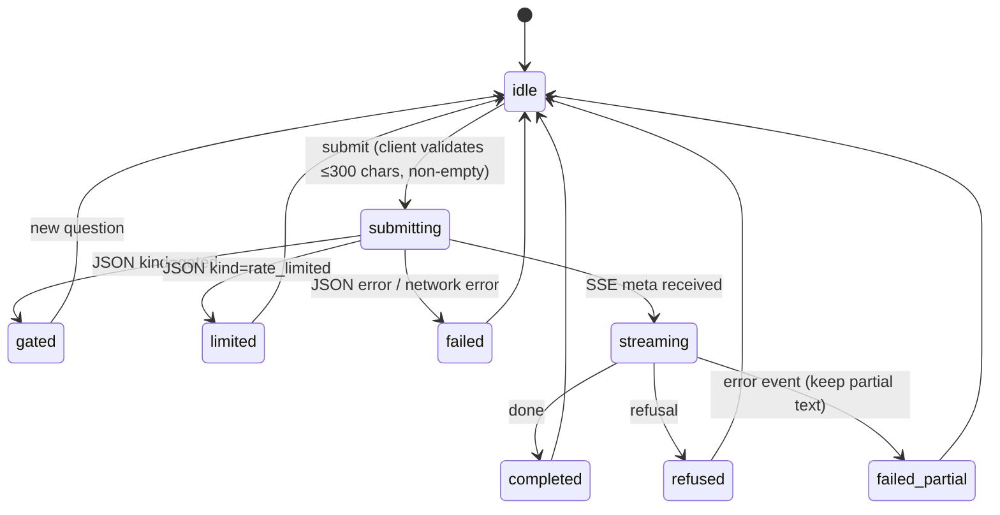

# Part 2b — UI & Deploy Design Spec

> Approved design from the 2026-07-12 brainstorm (Fable). Function was fixed by the v1
> spec §7 (`2026-07-08-laws-rag-design.md`); this spec fixes the concrete UI design,
> client architecture, server ride-alongs, and deploy plan. Visual decisions trace to
> `mockups/2026-07-12-part2b-ui-mockup.md` (Decisions table Q1–Q5) and the rendered
> palette artifacts beside it (`…-palette.pdf` is the decided v2 system).

## 1. What Part 2b ships

The first user-facing surface for The Fourth Official, plus production deploy:

1. **Gate screen** (`/gate`) — shared-password entry, sets the Part 2a session cookie.
2. **Ask screen** (`/`) — Option A "reference desk": one question in, one **ruling** out,
   streamed live, with clickable citations, quoted law passages, the glass-box panel,
   remaining-count badge, and a same-visit history list.
3. **Railway deploy** — including the two Mandatory-tier deploy blockers ruled on in the
   PR #16 review (memory `part2b-deploy-blockers`): trusted-XFF + counter ordering, and a
   high-entropy `DEMO_PASSWORD` as a deploy prerequisite.
4. **Ride-along fixes** from the PR #16 review and the Part 2a handoff (see §7).

**Explicitly out of scope:** prompt-injection hardening (own future spec session),
GitHub issue-spam triage (repo hygiene, outside build work), Playwright e2e suite
(deferred; manual smoke list + `verify` skill covers v1), sessionStorage history
persistence (approved as a future upgrade only).

## 2. Design decisions (settled — do not re-litigate)

| # | Decision | Choice |
|---|---|---|
| Q1 | Ask-screen identity | Reference desk (single column, ruling card) — matches the stateless one-shot API; not a chat |
| Q2 | Same-visit history | Collapsed client-side list; re-expand shows the full earlier ruling; page state only |
| Q3 | Citation interaction | Click `[n]` → scroll to passage + ~1s pitch-green highlight flash; no hover popovers |
| Q4 | Glass-box default | Open on the first answer of a visit, then remember the user's toggle |
| Q5 | Color scheme | Referee's kit v2: pitch-green single accent; true-yellow `#FACC15` **card-shaped badge fills** (never yellow text) for warnings; red-card `#DC2626` badges for errors |

Full reasoning and rejected alternatives: mockup file Decisions table.

## 3. Visual system

- **Style:** Swiss Modernism 2.0 — strict grid, high contrast, mathematical spacing,
  single accent, no decoration. Base tokens already exist in `globals.css`.
- **Palette (tokens go in `globals.css` `@theme`; never raw hex in components):**
  background `#FFFFFF`/`#0A0A0A`, foreground `#171717`/`#EDEDED`, accent pitch green
  `#15803D` light / `#22C55E` dark, yellow-card fill `#FACC15` (both themes), red-card
  fill `#DC2626` (error *text* on dark uses `#F87171`). AA fallback if yellow text is
  ever unavoidable in light mode: `#A16207`.
- **Card badge:** small rounded portrait rectangle (~11×15px, slight −8° tilt), fill
  carries the semantic color; message text stays foreground-colored. Rendered reference:
  `mockups/2026-07-12-part2b-palette.pdf`.
- **Type:** Geist Sans for prose/UI; Geist Mono for the **law register** — breadcrumbs,
  citation markers, similarity scores. Fix the scaffold quirk: remove the Arial
  `font-family` override in `globals.css` so the wired Geist variables actually apply.
- **Copy voice:** reuse the API's own strings verbatim where they exist; anything new is
  plain, referee-neutral, no exclamation marks.

## 4. Client architecture

Routes: `app/gate/page.tsx`, `app/page.tsx` (ask). Components in top-level
`components/`; pure logic in `lib/` (unit-testable, no React imports):

| Unit | Responsibility |
|---|---|
| `components/GateForm` | password field + submit; 204 → `router.push("/")`; 401 → red-card message below field, field keeps focus |
| `components/AskForm` | input (maxLength from shared constant), live character counter, Ask button (disabled while busy) |
| `components/RulingCard` | streamed answer text; renders `[n]` markers as buttons (`aria-label`, ≥44px target) |
| `components/LawPassages` | cited chunks as quoted passages with mono breadcrumbs; scroll target of Q3 clicks |
| `components/GlassBox` | collapsible table: 8 rows (breadcrumb, similarity, cited ✓/—) + gate-math line (`maxSim ≥ 0.35`); Q4 open/remember behavior |
| `components/HistoryList` | collapsed earlier Q&As; expanding re-renders that ruling from stored state |
| `components/RemainingBadge` | "x/20 today" from the latest payload that carried `remaining` |
| `components/CardBadge` | yellow/red card glyph + message text |
| `lib/constants.ts` | `MAX_QUESTION_CHARS` moved here from the route file (client + server import) |
| `lib/sse-client.ts` | incremental SSE parser: bytes → typed events (`meta`/`text`/`citation`/`refusal`/`done`/`error`); pure, fixture-testable |
| `lib/ask-stream.ts` | the ask state machine reducer (states below); pure |
| `hooks/useAskStream.ts` | thin: `fetch` POST + reader loop → dispatches into the reducer |

**Session gating for pages:** the middleware (renamed `proxy.ts`, §7) adds `/` to its
matcher and **redirects** page requests without a valid session to `/gate`
(`/api/ask` keeps returning 401 JSON). `/gate` and static assets stay unmatched.

## 5. Ask-flow data model

The client consumes the frozen Part 2a contract; no server contract changes.

```mermaid
sequenceDiagram
    participant U as Visitor
    participant P as Ask page
    participant A as POST /api/ask
    U->>P: types question, Ask
    P->>A: fetch (JSON body, cookies)
    alt JSON response
        A-->>P: gated | rate_limited(scope) | error(4xx/5xx)
        P-->>U: neutral gate copy + glass box | card badge + copy
    else SSE stream
        A-->>P: meta (chunks, remaining)
        A-->>P: text* / citation* (interleaved)
        A-->>P: done | refusal | error
        P-->>U: ruling streams in; passages + glass box render from meta + citations
    end
    P->>P: push Q&A into history, update remaining badge
```

State machine (reducer in `lib/ask-stream.ts`):



## 6. Error & guardrail presentation

| API outcome | Presentation |
|---|---|
| `kind: rate_limited` (visitor or global) | Yellow-card badge + the API's message; form disabled for `global` scope |
| SSE `error` mid-stream | Partial answer **stays on screen**, red-card badge + "answer incomplete — something went wrong" |
| `refusal` | Red-card badge + clean fallback copy; no partial-answer debris |
| `kind: gated` | Neutral (not an error): fixed message + glass box open showing retrieved chunks and `maxSimilarity` below the threshold line — the gate explains itself |
| 401 (expired/absent session) | Redirect to `/gate` |
| 400/502 JSON | Red-card badge + the API's message |

Accessibility: streamed status changes announced via `aria-live="polite"`; citation
markers are buttons; smooth scroll and the highlight flash respect
`prefers-reduced-motion`; all pairs AA in both themes.

## 7. Server-side ride-alongs

| Change | Source | Tier |
|---|---|---|
| `middleware.ts` → `proxy.ts` (Next 16 convention) + extended matcher with `/` redirect | handoff + §4 | Mandatory (touches auth gating) |
| Migration `0005`: `record_question` reordered — global counter increments **only if** the visitor cap passes; plus `REVOKE EXECUTE` from `anon`/`authenticated` on `record_question` (and `match_chunks`), pinned `search_path` | deploy blocker + review | Mandatory |
| Trusted-XFF fix in `/api/ask` once Railway's proxy chain is verified live (§8) | deploy blocker | Mandatory |
| HMAC domain separation in `lib/session.ts` (`"session:"`/`"pw:"` prefixes) — **note: invalidates existing sessions/logins; fine pre-launch** | review | Mandatory |
| SSE `cancel()` handler in `/api/ask` aborting the Anthropic stream | review | Standard |
| `MAX_QUESTION_CHARS` → `lib/constants.ts` | review | Routine |
| README rewrite + `app/layout.tsx` metadata (title "The Fourth Official", real description) + favicon replaced with a simple card/whistle mark (implementer's choice — Routine, not a design question) + `globals.css` Geist fix | handoff | Routine |
| CLAUDE.md accuracy fixes (`auth.ts`→`session.ts`, add `rate-limit.ts`/`supabase.ts`, migration 0003/0004 descriptions, file-layout for new UI dirs) | handoff | Routine |
| Delete `NEXT-SESSION.md` (its deferred list is fully absorbed by this spec + memory) | handoff | Routine |

## 8. Railway deploy

Prerequisites: all §7 Mandatory items merged; `DEMO_PASSWORD` regenerated as 32+ random
characters (the documented mitigation for the accepted login-rate-limit gap — see PR #16
review rulings).

1. Railway service from the GitHub repo (`main`), Next.js build.
2. Env vars: `SUPABASE_URL`, `SUPABASE_SERVICE_ROLE_KEY`, `VOYAGE_API_KEY`,
   `ANTHROPIC_API_KEY`, `ANTHROPIC_MODEL`, `DEMO_PASSWORD`, `SESSION_SECRET`.
3. Generate domain; verify HTTPS + `secure` cookies.
4. **XFF probe (answers the open IP-trust question):** request the deployed app with a
   spoofed `x-forwarded-for` and inspect what the route receives; determine which hop
   Railway's edge controls; implement the trusted-hop parse in `/api/ask`; redeploy.
5. Smoke list (§9) against production; confirm usage counters increment in Supabase.

Worst-case spend is unchanged from the v1 spec: global ceiling ≈ $2/day.

## 9. Testing

- **Unit (Vitest, repo conventions — no network, fixtures/fakes):** `sse-client` parser
  against recorded event fixtures (split-chunk boundaries included), `ask-stream`
  reducer per transition in §5, citation→passage mapping, history reducer,
  `visitorKey`/route behavior updates for the XFF fix, migration-0005 wrapper behavior
  (fake client), validation + counter copy.
- **Implementation-time design pass:** every UI task invokes the built-in
  `frontend-design` skill before writing components (design-process handoff rule).
- **Manual smoke (via `verify` skill, dev + production):** login (right/wrong password),
  ask happy path (stream + citations + glass box), gated question, visitor 429, global
  429 (lower env ceiling temporarily), refusal path, mid-stream kill (dev server stop),
  reduced-motion, mobile width (375px), light + dark.
- **Review battery:** per-task two-stage reviews; Mandatory items additionally get
  `security-reviewer` + `/security-review` before the PR.

## 10. Risk tiers

Mandatory: proxy/matcher, migration 0005, XFF fix, session-module changes.
Standard: all UI components/hooks, SSE client, deploy wiring.
Routine: README/metadata, CLAUDE.md fixes, constant move, `NEXT-SESSION.md` deletion.
