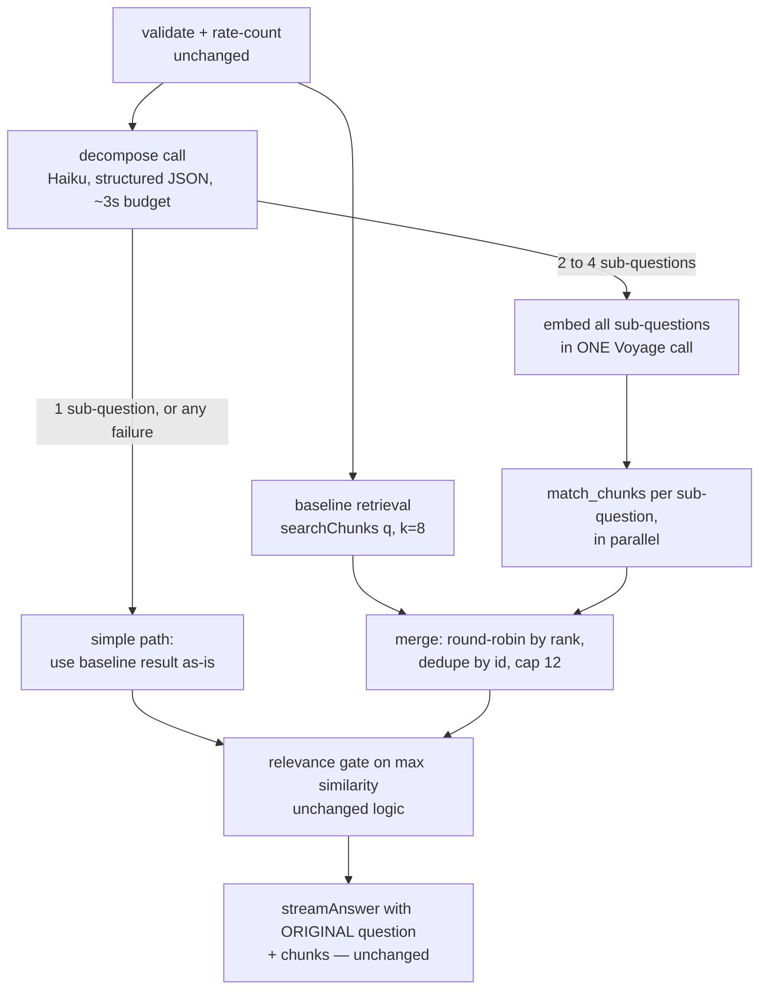

# Query Decomposition — Design Spec

**Date:** 2026-07-15 · **Status:** Approved (Markus, 2026-07-15, in-session)
**Tier:** Standard (retrieval layer), with security review added on the decompose
task (see §9). Traces to the compound-question eval spec
(`2026-07-14-compound-question-eval-design.md` §6, whose sketch this supersedes)
and its measured baseline: 2 of 9 compound questions — including the original
red-card failure — never reach full coverage even at k=24, so raising k cannot
fix them.

## 1. Problem

Single-pass retrieval embeds the visitor's question once and searches once. A
compound question ("What happens if everyone on a team gets a red card?") needs
passages from several law sections at once, and one embedding cannot sit close
to all of them — coverage stalls no matter how many results are fetched
(baseline: stuck at 2/4 required sections through k=24). The fix is to retrieve
*per concept*: split the question into self-contained sub-questions, search for
each, and merge.

**Build decision is settled** (2026-07-15): raising k was measured and ruled out
for the hardest cases; decomposition is the only remaining candidate. This spec
decides *how*, not *whether*.

## 2. Goals / Non-goals

**Goals**

1. Compound questions retrieve the sections a complete answer needs; the
   compound eval tier's full-coverage rate improves over the recorded 3/9 @ k=8.
2. Simple questions (the majority) are untouched: same latency (parallel
   design), same retrieval results, same behavior on any decomposer failure.
3. The improvement is a reproducible number: an opt-in eval mode runs the
   decomposed path against the compound tier.

**Non-goals**

- No change to the golden-set path, `RELEVANCE_THRESHOLD`, `match_chunks`, or
  per-sub-question k=8.
- No UI change — merged chunks render in the existing glass box.
- No corpus expansion (VAR-protocol back matter stays unindexed).
- No caching/memoization of decompositions (20-questions/day scale; YAGNI).

## 3. Architecture

The `/api/ask` pipeline keeps its shape — validate → rate-count → retrieve →
gate → stream — with the retrieve stage widened:

Key properties:

- **Parallel, not sequential** (decided in-session): the decompose call and the
  baseline retrieval fire concurrently. A simple verdict costs no added
  latency; a compound verdict reuses the baseline result in the merge.
- **The answering model never sees sub-questions.** `streamAnswer(question,
  chunks)` receives the visitor's original question; decomposition steers
  retrieval only.
- **The decomposer is an optimization, never a dependency.** Every failure mode
  (§6) lands on the simple path — byte-for-byte today's behavior.

New code lives in `lib/decompose.ts` (call + parse/validate) and a merge
function in `lib/retrieval.ts` beside the existing result helpers, per the
Global Constraint that logic never lives in `app/`.

## 4. Decompose contract

- **Model:** fixed constant `claude-haiku-4-5` — deliberately *not*
  `ANSWER_MODEL()`, so upgrading the answering model never silently raises the
  splitter's cost. Reuses the existing Anthropic SDK client setup.
- **Output:** structured outputs (`output_config.format`, JSON schema) — the
  API guarantees the response parses as `{ "sub_questions": string[] }`.
- **Prompt:** system prompt contains instructions only ("split into 1–4
  self-contained sub-questions about football rules; return exactly 1 if the
  question is already simple"); the visitor's question goes in the user message
  as data — same discipline as `lib/answer.ts`.
- **Post-parse validation (code, since JSON Schema can't express item
  counts):** trim and drop empty strings; if more than 4 remain, keep the
  first 4; if 0 remain → fallback. Result of exactly 1 → simple path.
- **Budget:** ~3 s timeout; on expiry the call is abandoned and the baseline
  result is used.

## 5. Merge policy

Inputs: the baseline ranked list plus one ranked list per sub-question (each up
to 8 chunks, ordered by RRF score from `match_chunks`).

1. **Round-robin by rank:** all rank-1 chunks first (baseline list first, then
   sub-questions in order), then all rank-2, and so on — each sub-question's
   best evidence survives the cap instead of one list's tail crowding out
   another's head.
2. **Dedupe by chunk id**, keeping the first (best-ranked) occurrence.
3. **Cap at 12 chunks** (§6 of the eval spec; a modest generation-cost increase
   over k=8, paid only on compound questions).
4. **Gate semantics:** `maxSimilarity` of the merged result = max across *all*
   contributing results. `isRelevant` and the 0.35 threshold are unchanged; an
   off-topic question stays sub-threshold however it is split, preserving
   abstain behavior.

## 6. Error handling

| Failure | Handling |
|---|---|
| Decompose call errors (network, 429, 5xx) | Fall back to baseline; log warning |
| `stop_reason: "refusal"`, malformed or empty output | Same fallback |
| Decompose exceeds ~3 s | Abandon call; baseline path |
| Sub-question batch embed fails (e.g. Voyage free-tier 429 burst) | Baseline path |
| One sub-question's `match_chunks` fails | Merge the lists that succeeded (baseline included) |
| Baseline retrieval fails | 502 — same as today; the one fatal error, already fatal now |

No retries in the decomposer: with a live visitor waiting, falling back beats
retrying.

## 7. Cost & latency

- **Simple questions:** decompose runs concurrently with baseline retrieval
  (~0.5–1 s); added wait ≈ 0.
- **Compound questions:** one extra embed round-trip + parallel searches; ~1 s
  extra before streaming starts.
- **Spend:** one Haiku call per question (cent-fractions), bounded by the
  existing 20/day visitor cap and global ceiling; the rate-count precedes the
  decompose call, so gated/rate-limited questions never reach Haiku. No new
  guardrail work.
- **Known residual risk:** Voyage free tier allows 3 requests/minute; compound
  questions add a second embed call, so a burst can 429 the sub-question embed.
  The fallback covers it — worst case is decomposition silently not helping
  during the burst.

## 8. Threat model note

The decomposer is the first production code where an LLM's output steers later
processing, so its output is constrained hard:

- Output is schema-bound JSON (structured outputs), then code-validated.
- Parsed sub-questions are **data only**: they flow into `embedTexts` and the
  `match_chunks` `query_text` parameter, and are never concatenated into any
  prompt (the answer model receives only the original question; the decomposer
  system prompt contains no user content).
- Worst case from a hostile question is therefore bad retrieval — the same
  worst case an arbitrary weird question produces today, already bounded by the
  relevance gate and the answer model's answer-only-from-documents rules.

## 9. Testing & reviews

**Unit tests** (Vitest, `tests/` mirroring `lib/`):

- Parse/validate (pure): valid 2–4 splits; single; empty strings dropped; >4
  truncated; garbage → fallback signal.
- Merge (pure): round-robin order; dedupe keeps best rank; cap 12; empty
  lists; merged `maxSimilarity` across all sources.
- `decompose()` with an injected mock Anthropic client (the `streamAnswer`
  pattern): happy path, refusal, error, timeout — all falling back.
- Existing route tests continue to cover the simple path unchanged.

**Eval mode:** `npm run eval -- --decompose` runs the compound tier through
decompose → multi-retrieve → merge and prints the same per-question coverage
table plus summary. Requires `ANTHROPIC_API_KEY` (present in `.env.local`);
costs ~a cent; mildly nondeterministic (an LLM chooses the split). The default
`npm run eval` is untouched — free, deterministic, same gates.

**Reviews:** Standard tier (per-task two-stage + `reviewer` agent), **plus**
`/security-review` and the `security-reviewer` agent on the decompose task
specifically — a deliberate half-step above Standard scoped to the one new
user-input→LLM surface.

## 10. Regression bar (all must hold before merge)

1. Golden 30/30 recall@8, paraphrase, and abstain results unchanged (default
   eval path and production simple path are untouched code).
2. Compound tier full coverage improves over the recorded 3/9 @ k=8 in
   `--decompose` mode; before/after numbers recorded in this spec's revision
   history and `docs/project-reviewer.md`.
3. End-to-end acceptance: the original red-card question, asked in the deployed
   app, produces a correct "an abandoned match does not become a penalty
   shoot-out" ruling. Manual check by Markus (password gate blocks agent
   click-testing — same arrangement as Part 2b).

## 11. Deliverables (implementation plan's checklist)

1. `lib/decompose.ts` — Haiku call, structured output, parse/validate, timeout,
   fallback signal + unit tests.
2. Merge function + route wiring (parallel fire, merge, gate) + unit tests.
3. Eval `--decompose` mode.
4. Measurement: `--decompose` compound run recorded; regression bar checked;
   docs (this spec's revision history, `project-reviewer.md`, README limitation
   line updated to note the fix).

~4–5 tasks; one plan; Standard-tier execution suitable for a cheap-model
session per the established split.

## 12. Risks

- **Decomposer splits badly** (over-splits simple questions, or splits into
  off-corpus concepts): bounded by the merge cap, the unchanged gate, and the
  answer model seeing only the original question; measured by the compound tier
  and golden-set invariance.
- **Overfitting to the 9-question tier:** the tier is a yardstick, not a proof
  — hence the end-to-end acceptance check on the live app (§10.3).
- **Voyage free-tier burst 429s** (§7): accepted; fallback degrades gracefully.

## Revision history

| Date | Change |
|---|---|
| 2026-07-15 | Initial spec — approved in-session (parallel architecture, opt-in eval mode). |
