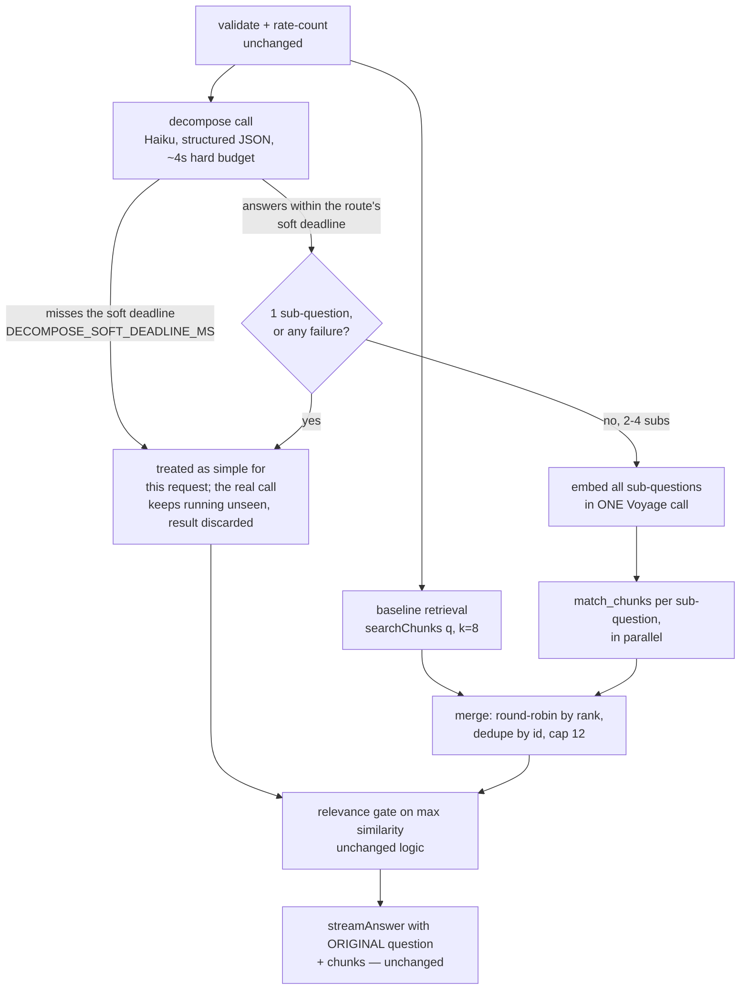

# Query Decomposition — Design Spec

**Date:** 2026-07-15 · **Status:** Approved (Markus, 2026-07-15, in-session)
**Tier:** Standard (retrieval layer), with security review added on the decompose
task (see §9). Traces to the compound-question eval spec
(`2026-07-14-compound-question-eval-design.md` §6, whose sketch this supersedes)
and its measured baseline: 2 of 9 compound questions — including the original
red-card failure — never reach full coverage even at k=24, so raising k cannot
fix them.

## 1. Problem

Single-pass retrieval embeds the visitor's question once and searches once. A
compound question ("What happens if everyone on a team gets a red card?") needs
passages from several law sections at once, and one embedding cannot sit close
to all of them — coverage stalls no matter how many results are fetched
(baseline: stuck at 2/4 required sections through k=24). The fix is to retrieve
*per concept*: split the question into self-contained sub-questions, search for
each, and merge.

**Build decision is settled** (2026-07-15): raising k was measured and ruled out
for the hardest cases; decomposition is the only remaining candidate. This spec
decides *how*, not *whether*.

## 2. Goals / Non-goals

**Goals**

1. Compound questions retrieve the sections a complete answer needs; the
   compound eval tier's full-coverage rate improves over the recorded 3/9 @ k=8.
2. Simple questions (the majority) keep the same retrieval results and the
   same behavior on any decomposer failure. Latency is *bounded*, not
   guaranteed byte-for-byte identical and not near-zero: a soft deadline
   (§3, §4) caps the worst-case added wait instead of exposing every request
   to decompose's full budget. Measurement (revised 2026-07-15 a second time,
   after real latency data — see the revision-history entries) found the
   original "same latency, unconditionally" framing didn't hold under the
   reference implementation, AND that decompose's real-world latency floor
   (~1s+ for a live Haiku call) means the honest common-case added latency is
   **~0.5–1.5s over baseline, capped around 2s** — not "≈0". §7 has the full
   numbers and reasoning.
3. The improvement is a reproducible number: an opt-in eval mode runs the
   decomposed path against the compound tier.

**Non-goals**

- No change to the golden-set path, `RELEVANCE_THRESHOLD`, `match_chunks`, or
  per-sub-question k=8.
- No UI change — merged chunks render in the existing glass box.
- No corpus expansion (VAR-protocol back matter stays unindexed).
- No caching/memoization of decompositions (20-questions/day scale; YAGNI).
- Byte-for-byte identical latency for every simple question is explicitly not
  a goal (revised 2026-07-15): the soft-deadline mechanism (§3) makes
  compound detection timing-dependent by design, in exchange for a bounded
  worst case. See §7's residual-risk entry.

## 3. Architecture

The `/api/ask` pipeline keeps its shape — validate → rate-count → retrieve →
gate → stream — with the retrieve stage widened:

Key properties:

- **Parallel, bounded by a soft deadline measured from the elapsed wait, not a
  fixed wall clock** (revised 2026-07-15 for the reason above; refined
  2026-07-15 per Fable's design review on the amendment PR — see the
  revision-history entries): both calls fire concurrently. The route awaits
  `searchChunks` first (as it always did); once that settles, it checks how
  much of `DECOMPOSE_SOFT_DEADLINE_MS` has already elapsed since both calls
  started, and gives decompose only the *remaining* budget (`max(0,
  DECOMPOSE_SOFT_DEADLINE_MS - elapsedSinceStart)`) before giving up. This is
  a deliberate refinement over a naive fixed-wall-clock race: if baseline
  retrieval itself already took longer than the soft deadline (the case a
  fixed-clock race would waste the most decompose results in), decompose has
  almost always already resolved during that wait, and the route uses its
  real answer for free instead of discarding it — same worst-case latency
  bound (`max(baseline, min(decompose, soft deadline))`), strictly fewer
  timing-dependent misses. If decompose still hasn't answered once its
  remaining budget also elapses, the request proceeds on the baseline result
  alone, exactly as if decompose had returned a single sub-question; the
  abandoned decompose call keeps running to completion in the background (it
  cannot reject — §4 — so nothing needs cleanup) and its result is simply
  never read. This bounds a simple question's worst-case added latency to the
  soft deadline instead of decompose's full budget, at the cost of making
  compound detection genuinely timing-dependent — see the Known residual risk
  in §7, the Non-goal in §2, and the acceptance threshold in §10.4.
- **The answering model never sees sub-questions.** `streamAnswer(question,
  chunks)` receives the visitor's original question; decomposition steers
  retrieval only.
- **The decomposer is an optimization, never a dependency.** Every failure mode
  (§6) lands on the simple path — byte-for-byte today's behavior.

New code lives in `lib/decompose.ts` (call + parse/validate + both the hard
timeout and the soft-deadline constants) and a merge function in
`lib/retrieval.ts` beside the existing result helpers, per the Global
Constraint that logic never lives in `app/`. The soft-deadline race itself is
route-only wiring (`app/api/ask/route.ts`); the eval's `--decompose` mode
(§9) deliberately does not apply it, since that mode measures full
decomposition coverage, not production latency.

## 4. Decompose contract

- **Model:** fixed constant `claude-haiku-4-5` — deliberately *not*
  `ANSWER_MODEL()`, so upgrading the answering model never silently raises the
  splitter's cost. Reuses the existing Anthropic SDK client setup.
- **Output:** structured outputs (`output_config.format`, JSON schema) — the
  API guarantees the response parses as `{ "sub_questions": string[] }`.
- **Prompt:** system prompt contains instructions only ("split into 1–4
  self-contained sub-questions about football rules; return exactly 1 if the
  question is already simple"); the visitor's question goes in the user message
  as data — same discipline as `lib/answer.ts`.
- **Post-parse validation (code, since JSON Schema can't express item
  counts):** trim and drop empty strings; if more than 4 remain, keep the
  first 4; if 0 remain → fallback. Result of exactly 1 → simple path.
- **Budget:** two separate timeouts, deliberately not conflated:
  - `DECOMPOSE_TIMEOUT_MS` (**4000ms, revised 2026-07-15 from the original
    3000ms** — a real measured call was clipped at exactly 3000ms by this
    timeout, meaning the original value was cutting into the genuine tail of
    decompose's latency distribution rather than only guarding against true
    outliers; production latency is unaffected by this bump, since production
    never waits past the soft deadline below — the only two things that
    consume this bound are the abandoned background call's own lifetime and
    the eval's `--decompose` mode) — the SDK-level hard timeout on the call
    itself, inside `decompose()`. On expiry the call rejects the promise
    internally and `decompose()` resolves to `null`, same as any other
    failure mode. This bound still matters even though production never
    *waits* past the soft deadline (below): it's what guarantees the
    abandoned background call eventually finishes and stops consuming
    resources, and it's the only timing guard on the eval's `--decompose`
    mode (Task 4), which awaits `decompose()` to full completion and applies
    no soft deadline at all (§3, §9).
  - `DECOMPOSE_SOFT_DEADLINE_MS` (**2500ms, revised 2026-07-15 from the
    original 800ms estimate** — real measurement found the original estimate
    left the feature close to a no-op in production; see §7 and §10.4 for
    the full derivation and the larger-sample validation that confirms or
    adjusts this value before merge), exported alongside
    `DECOMPOSE_TIMEOUT_MS` from `lib/decompose.ts` for cohesion with the
    other decompose-call constants, even though it's consumed only by the
    route — the total time budget (measured from when both calls start,
    not a second independent clock — §3) that `/api/ask` gives decompose's
    answer before proceeding as simple for this request. This is *not* a
    property of `decompose()` itself — the function's own contract (never
    rejects) is unchanged; the route just stops listening for the answer
    earlier. Note this races decompose's full non-streaming completion, not
    time-to-first-token — a genuine driver of why this needed to be much
    higher than the original 800ms guess.

## 5. Merge policy

Inputs: the baseline ranked list plus one ranked list per sub-question (each up
to 8 chunks, ordered by RRF score from `match_chunks`).

1. **Round-robin by rank:** all rank-1 chunks first (baseline list first, then
   sub-questions in order), then all rank-2, and so on — each sub-question's
   best evidence survives the cap instead of one list's tail crowding out
   another's head.
2. **Dedupe by chunk id**, keeping the first (best-ranked) occurrence.
3. **Cap at 12 chunks** (§6 of the eval spec; a modest generation-cost increase
   over k=8, paid only on compound questions).
4. **Gate semantics:** `maxSimilarity` of the merged result = max across *all*
   contributing results. `isRelevant` and the 0.35 threshold are unchanged; an
   off-topic question stays sub-threshold however it is split, preserving
   abstain behavior.

## 6. Error handling

| Failure | Handling |
|---|---|
| Decompose call errors (network, 429, 5xx) | Fall back to baseline; log warning |
| `stop_reason: "refusal"`, malformed or empty output | Same fallback |
| Decompose exceeds ~4 s (its own hard budget) | Abandon call; baseline path |
| Decompose answers after the route's soft deadline but before its own ~4s hard budget | Route already proceeded on baseline for this request; the late answer is discarded, not used, not retried |
| Sub-question batch embed fails (e.g. Voyage free-tier 429 burst) | Baseline path |
| One sub-question's `match_chunks` fails | Merge the lists that succeeded (baseline included) |
| Baseline retrieval fails | 502 — same as today; the one fatal error, already fatal now |

No retries in the decomposer: with a live visitor waiting, falling back beats
retrying.

## 7. Cost & latency

- **Simple questions:** decompose runs concurrently with baseline retrieval,
  bounded by `DECOMPOSE_SOFT_DEADLINE_MS` measured from elapsed wait (§3, §4).
  Total retrieval-phase latency is `max(baseline, min(decompose, soft
  deadline))`; the latency *added* over baseline-alone (pre-feature) is
  `max(0, min(decompose, soft deadline) − baseline)`. This replaces the
  original "added wait ≈ 0, unconditionally" claim, which a task-review pass
  (2026-07-15) found didn't actually hold under the reference `Promise.all`
  shape — see the revision-history entry below.

  **Revised again (2026-07-15, second pass) with real numbers.** A first
  attempt at measuring this used the compound-tier `--decompose` eval runs
  (n=9) and found decompose's real latency floor is much higher than assumed
  — live Haiku calls with structured JSON output routinely take **~1–3
  seconds**, not sub-second. The honest common-case added latency for a
  *simple* question is **~0.5–1.5s over baseline, capped around 2s** — not
  "≈0". (One mitigating factor: the 1–3s figures were measured on
  *compound*-tier questions, whose decompose output is 2–4 full sub-questions
  — a simple question's output is much shorter, just the question echoed
  back, so simple-question decompose latency should sit toward the fast end
  of that range; §10.4's dedicated sample is what actually confirms this,
  not an assumption.) `DECOMPOSE_SOFT_DEADLINE_MS = 2500` (up from the
  original 800ms estimate) is the current working value — see §4 and §10.4
  for how it was derived and how it's validated before merge.
- **Compound questions:** one extra embed round-trip + parallel searches; ~1 s
  extra before streaming starts (unchanged).
- **Spend:** one Haiku call per question (cent-fractions), bounded by the
  existing 20/day visitor cap and global ceiling; the rate-count precedes the
  decompose call, so gated/rate-limited questions never reach Haiku. No new
  guardrail work. Note: an abandoned (soft-deadline-missed) decompose call
  still completes and still costs the same Haiku call — the soft deadline
  changes what the route waits for, not what gets spent.
- **Known residual risk (Voyage burst):** Voyage free tier allows 3
  requests/minute; compound questions add a second embed call, so a burst can
  429 the sub-question embed. The fallback covers it — worst case is
  decomposition silently not helping during the burst.
- **Known residual risk (timing-dependent compound detection, new
  2026-07-15):** a genuinely compound question can occasionally be treated as
  simple if decompose's answer arrives after the soft deadline — the same
  question could get different treatment on different requests depending on
  Haiku's response time that request. Accepted: it trades a rare, bounded
  quality loss (one compound question, one request, gets simple-path
  retrieval) for capping every request's worst-case latency, rather than
  exposing every request to up to 3s of added wait for the sake of catching
  the rare slow-decompose case. §10.4 defines the measurement that quantifies
  how often this actually happens, and its statistical power.

## 8. Threat model note

The decomposer is the first production code where an LLM's output steers later
processing, so its output is constrained hard:

- Output is schema-bound JSON (structured outputs), then code-validated.
- Parsed sub-questions are **data only**: they flow into `embedTexts` and the
  `match_chunks` `query_text` parameter, and are never concatenated into any
  prompt (the answer model receives only the original question; the decomposer
  system prompt contains no user content).
- Worst case from a hostile question is therefore bad retrieval — the same
  worst case an arbitrary weird question produces today, already bounded by the
  relevance gate and the answer model's answer-only-from-documents rules.

## 9. Testing & reviews

**Unit tests** (Vitest, `tests/` mirroring `lib/`):

- Parse/validate (pure): valid 2–4 splits; single; empty strings dropped; >4
  truncated; garbage → fallback signal.
- Merge (pure): round-robin order; dedupe keeps best rank; cap 12; empty
  lists; merged `maxSimilarity` across all sources.
- `decompose()` with an injected mock Anthropic client (the `streamAnswer`
  pattern): happy path, refusal, error, timeout — all falling back.
- Existing route tests continue to cover the simple path unchanged.
- **Route soft-deadline race (new 2026-07-15):** using fake timers (or a mock
  `decompose` that resolves after a controllable delay), verify (a) a
  `decompose` mock that resolves before `DECOMPOSE_SOFT_DEADLINE_MS` still
  drives the compound path normally, (b) a mock that resolves after the soft
  deadline is treated as simple for that request, and (c) the late-resolving
  mock's eventual result has no observable effect once the response has
  already been produced (no dangling state, no unhandled rejection — it
  can't reject per §4, but assert the resolved value is simply never read).

**Eval mode:** `npm run eval -- --decompose` runs the compound tier through
decompose → multi-retrieve → merge and prints the same per-question coverage
table plus summary. Requires `ANTHROPIC_API_KEY` (present in `.env.local`);
costs ~a cent; mildly nondeterministic (an LLM chooses the split). The default
`npm run eval` is untouched — free, deterministic, same gates.

**Reviews:** Standard tier (per-task two-stage + `reviewer` agent), **plus**
`/security-review` and the `security-reviewer` agent on the decompose task
specifically — a deliberate half-step above Standard scoped to the one new
user-input→LLM surface.

## 10. Regression bar (all must hold before merge)

1. Golden 30/30 recall@8, paraphrase, and abstain results unchanged (default
   eval path and production simple path are untouched code).
2. Compound tier full coverage improves over the recorded 3/9 @ k=8 in
   `--decompose` mode; before/after numbers recorded in this spec's revision
   history and `docs/project-reviewer.md`. **This number is an upper bound on
   production**, not a guarantee of it (flagged in Fable's design review,
   2026-07-15): the eval mode always awaits `decompose()` to full completion
   and applies no soft deadline (§3, §9), while production gives up after
   `DECOMPOSE_SOFT_DEADLINE_MS`. Bar #4 below is what actually bounds the
   production gap.
3. End-to-end acceptance: the original red-card question, asked in the deployed
   app, produces a correct "an abandoned match does not become a penalty
   shoot-out" ruling. Manual check by Markus (password gate blocks agent
   click-testing — same arrangement as Part 2b).
4. **Soft-deadline validation, with an acceptance threshold** (new 2026-07-15;
   threshold added 2026-07-15 per Fable's design review — a BLOCKER: recording
   the miss rate without a pass/fail line would let this bar pass while the
   soft deadline silently disabled compound detection in production).

   **Superseded 2026-07-15 (second pass): the n=9 measurement had inadequate
   statistical power.** The original approach reused the two 9-question
   `--decompose` eval runs. At n=9, "under 20%" operationally means "at most 1
   miss" — an effective 11.1% bar, not 20% — and at n=9 even a genuinely-good
   ~11%-true-rate configuration only passes **both** runs by chance about 55%
   of the time (binomial: P(≤1 miss in 9) ≈ 0.74 per run, squared for both
   runs). The first attempt at this measurement (800ms, then 2500ms) produced
   a 100% miss rate and then a 22% miss rate respectively — the second result
   is not strong evidence 2500ms is wrong; it's within the noise band a small
   sample produces even for a passing configuration. **The fix is measurement
   power, not the threshold or an aggressively raised deadline** (Fable's
   design review, 2026-07-15): decompose() only touches the Anthropic API —
   no Voyage, no Supabase, no rate-limit spacing needed — so a dedicated
   decompose-only sample can run far more trials for negligible extra cost.

   **Current measurement:** a throwaway script (Task 5) times `decompose()`
   directly (`Date.now()` around the call, no harness involvement) against
   all 9 compound-tier questions, cycled **8× each (n = 72)**, recording for
   each call whether its raw latency exceeded `DECOMPOSE_SOFT_DEADLINE_MS`
   (2500ms — §4), and whether the result was suspiciously fast-and-null (a
   likely API/auth error masquerading as a fast success — a real false-pass
   risk an independent review, PR #56, caught: `decompose()` never rejects,
   so a broken API key resolves near-instantly to `null` for every call,
   which would otherwise look like a perfect 0% miss rate). Takes roughly
   2-3 minutes, costs well under a cent. **Sample size caveat, honestly
   disclosed:** n=72 gives ~2% granularity, still not a large-N guarantee —
   good enough to make an informed constant choice for a 20-questions/day
   demo, not a rigorously powered statistical test. If Markus wants tighter
   confidence, the same script scales to a larger n at the same per-call
   cost.

   **Acceptance threshold: miss rate must be under 20% on the n=72 sample.**
   - **A modest overshoot (20-30%)** is a borderline result, not proof the
     mechanism is unworkable — a 25% miss rate still means the feature helps
     75% of genuinely compound questions. Try one bounded further increase to
     `DECOMPOSE_SOFT_DEADLINE_MS` (e.g. +500ms) and re-measure once. **Do not
     creep it repeatedly** toward `DECOMPOSE_TIMEOUT_MS` — a soft deadline
     within noise of the hard timeout is no longer a meaningful design
     element (see §4's rationale for keeping them distinct).
   - **A substantial miss rate (roughly ≥30-40%), or a bounded increase that
     doesn't help,** is the real signal to stop tuning and escalate to
     Markus. The honest fallback is deleting the soft-deadline race entirely
     and simply awaiting `decompose()` under its hard timeout (this was the
     reverted `Promise.all` shape from earlier in this branch's history —
     reinstating it would then be a *measured decision*, not the unexamined
     default it was the first time). **This fallback explicitly abandons the
     companion latency bar below, not a latency-neutral alternative** — every
     question, not just compound ones, would pay up to the full hard timeout
     in exchange for perfect compound detection; be explicit about that
     tradeoff when presenting it to Markus.

   **Companion bar — simple-question added latency must also pass, not just
   the miss rate:** the miss-rate bar alone doesn't bound the actual user-
   facing cost of a high `DECOMPOSE_SOFT_DEADLINE_MS`. Step 2c's existing
   simple-question latency sample (p50/max added latency, §7) gets its own
   threshold: **p50 added latency should be comfortably under 1500ms.** If
   raising the deadline to clear the miss-rate bar pushes simple-question p50
   added latency past that line, both bars can't be satisfied simultaneously
   at any single value — STOP and escalate to Markus rather than picking one
   bar over the other unilaterally.

   Numbers recorded in this spec's revision history alongside the coverage
   numbers: n=72 sample's miss rate, p50/max simple-question added latency,
   and the final `DECOMPOSE_SOFT_DEADLINE_MS`/`DECOMPOSE_TIMEOUT_MS` values
   (2500ms/4000ms are the working values pending this measurement — see §4).

## 11. Deliverables (implementation plan's checklist)

1. `lib/decompose.ts` — Haiku call, structured output, parse/validate, timeout,
   fallback signal + unit tests.
2. Merge function + route wiring (parallel fire, elapsed-aware soft-deadline
   race per §3/§4, merge, gate) + unit tests including the soft-deadline race
   cases (§9).
3. Eval `--decompose` mode (no soft deadline applied — §3, §9).
4. Measurement: `--decompose` compound run recorded (both runs, per the
   nondeterminism check); soft-deadline miss rate recorded against its <20%
   acceptance threshold (§10.4); regression bar checked; docs (this spec's
   revision history, `project-reviewer.md`, README limitation line updated to
   note the fix).

~4–5 tasks; one plan; Standard-tier execution suitable for a cheap-model
session per the established split.

## 12. Risks

- **Decomposer splits badly** (over-splits simple questions, or splits into
  off-corpus concepts): bounded by the merge cap, the unchanged gate, and the
  answer model seeing only the original question; measured by the compound tier
  and golden-set invariance.
- **Overfitting to the 9-question tier:** the tier is a yardstick, not a proof
  — hence the end-to-end acceptance check on the live app (§10.3).
- **Voyage free-tier burst 429s** (§7): accepted; fallback degrades gracefully.

## Revision history

| Date | Change |
|---|---|
| 2026-07-15 | Initial spec — approved in-session (parallel architecture, opt-in eval mode). |
| 2026-07-15 | Retrieval-timing redesign: Task 3's task-review pass found that the reference `Promise.all([searchChunks, decompose])` shape (§3, as originally given in the implementation plan) blocks *every* request — including simple ones — on decompose's full latency, contradicting Goal 2's "added wait ≈ 0" claim; the route's own comment claiming a "race" was inaccurate for `Promise.all` semantics. Replaced with a bounded soft-deadline race: the route waits on decompose only up to `DECOMPOSE_SOFT_DEADLINE_MS` (proposed 800ms, separate from decompose's own ~3s hard budget), falling back to the baseline path if decompose hasn't answered in time. Trades a new, disclosed risk (compound detection becomes timing-dependent — §7) for a bounded worst-case latency instead of an unconditional one. Approved by Markus (brainstorming session, 2026-07-15) pending Fable's design review on this PR before merge. |
| 2026-07-15 | Fable's design review (PR #49) approved the mechanism but found 1 BLOCKER + 3 SUGGESTIONs: (1, BLOCKER, fixed) added an acceptance threshold (§10.4, <20% soft-deadline miss rate on the compound tier) instead of only recording the miss rate — as written, the eval's coverage number (§10.2) could pass while the soft deadline silently disabled compound detection in production; §10.2 now notes the eval number is an upper bound, not a guarantee, on production. (2, SUGGESTION, adopted) refined the soft deadline from a fixed wall-clock cutoff to one measured from elapsed wait since both calls started (§3, §4) — same worst-case latency bound, strictly fewer timing-dependent misses, since a decompose result that arrives while the route is still stuck waiting on a slow baseline is no longer wastefully discarded. (3, SUGGESTION, adopted) softened §7's "usually fast" framing — the soft deadline races decompose's full non-streaming completion, not time-to-first-token. (4, SUGGESTION, adopted) clarified why the ~3s hard budget still matters post-redesign (§4): it bounds the abandoned background call's resource lifetime and remains the only timing guard on the eval's `--decompose` mode. Two NITs also fixed: §7's latency formula was mislabeled "added" when it described total latency; §11's deliverables checklist now names the soft-deadline race and the miss-rate measurement explicitly. |
| 2026-07-15 | Fable's follow-up re-review (PR #49) confirmed the BLOCKER fix and the elapsed-aware deadline math, and approved with one new SUGGESTION (adopted): the eval harness's own `withVoyageRetry` backoff can inflate its "baseline" elapsed time to tens of seconds under the elapsed-aware formula, far looser than production's normally-sub-second `searchChunks` — so reusing the two `--decompose` eval runs verbatim for §10.4's miss-rate measurement would likely understate real production risk, making the 20% threshold decorative. §10.4 now requires Task 5 to measure `decompose()`'s raw latency directly against the fixed soft deadline for this specific bar, not the harness's own inflated elapsed time. Zero BLOCKERs remain — approved for merge. |
| 2026-07-15 | **Second design pass, after real measurement (docs/decompose-latency-threshold branch, off feat/query-decomposition):** Task 5 measured `DECOMPOSE_SOFT_DEADLINE_MS` at its shipped 800ms and found a 100% miss rate — the feature would be a near-total no-op in production. Raised to 2500ms and re-measured: still 22% (above the 20% bar). Investigation into a fixable root cause (hidden extended thinking, missing prompt-cache eligibility, first-request schema-compilation cost, `max_tokens` inflation) came back empty — decompose's real latency floor (~1–3s for a live Haiku structured-output call) appears to be inherent, not a bug. Fable's design input identified the actual root cause: at n=9, "under 20%" is really an ~11% bar, and even a genuinely-passing configuration only clears both measurement runs by chance ~55% of the time — the 22% result wasn't strong evidence 2500ms is wrong, just small-sample noise. Resolution: keep 2500ms/4000ms (`DECOMPOSE_SOFT_DEADLINE_MS`/`DECOMPOSE_TIMEOUT_MS`, up from 800ms/3000ms) as working values, replace the n=9 reused-eval-run measurement with a dedicated n≥36 decompose-only sample (§10.4) for adequate statistical power, add a companion acceptance bar on simple-question added latency (p50 < 1500ms) so both sides of the tradeoff have a pass/fail line, and pre-commit to an escalation path (delete the soft-deadline race, don't creep the deadline toward the hard timeout) if the larger sample still fails. §2 Goal 2 and §7 rewritten to state the honest common-case added latency (~0.5–1.5s, capped ~2s) instead of "≈0". Pending Fable's review of this revision before merge back into `feat/query-decomposition`. |
| 2026-07-15 | Fable's fresh-context review (PR #56) verified the n=9 statistics claim independently (confirmed correct, and noted it understates the problem at higher true miss rates) and found 1 BLOCKER + 3 SUGGESTIONs: (1, BLOCKER, fixed) both new throwaway sampling scripts (§10.4) could print a false-passing 0% miss rate if `ANTHROPIC_API_KEY` were missing/invalid — `decompose()` never rejects (Task 1 contract), so a broken key resolves every call to `null` in ~0ms, which looked identical to genuinely fast, successful calls. Fixed: both scripts now fail fast if the key is unset, track null-result counts, and warn if null results average under 200ms (a strong signal of an error, not a genuine timeout/refusal). (2, SUGGESTION, adopted) raised the miss-rate sample from n=36 (4 cycles) to n=72 (8 cycles) — marginal cost ~1 more minute for meaningfully tighter statistical power. (3, SUGGESTION, adopted) softened the escalation rule: a modest 20-30% miss rate now gets one bounded further deadline increase and a re-measure, rather than immediately treating any ≥20% result as proof the mechanism is unworkable; only a substantial miss rate (≥30-40%) or a bounded increase that doesn't help triggers escalation to Markus. (4, SUGGESTION, adopted) made explicit that the escalation fallback (deleting the soft-deadline race) abandons the companion latency bar by design — it's the opposite tradeoff, not a latency-neutral alternative. Fixes applied; pending Fable's confirmation before merge. |
| 2026-07-15 | Fable's follow-up re-review (PR #56) found the BLOCKER fix itself was subtly broken in the second (simple-question latency) script: it checked `totalMs < 200`, but `totalMs` is elapsed time since BOTH calls started, dominated by baseline retrieval's own latency (normally well over 200ms per §7) — a broken API key would never trip that check even though it's exactly the failure mode the fix exists to catch, reintroducing the false-pass bug in the twin script. **Fixed** (Task 5 Step 2d): the script now tracks `decompose()`'s own settle time independently via a `.then()` handler, separate from the race's total elapsed time, so the null/fast-error check fires only on decompose's actual duration. Also adopted 2 minor SUGGESTIONs: the 20%/30% escalation boundary is no longer ambiguously double-covered by both buckets, and the bounded-retry step now gives the concrete edit (`DECOMPOSE_SOFT_DEADLINE_MS` 2500→3000) instead of a vague "try increasing it." One more SUGGESTION adopted: `lib/decompose.ts`'s doc-comments above both timing constants (not just their literal values) get updated in Task 5 Step 2a, since the originals described a pre-measurement state ("initial estimate pending validation") that's now stale. |
